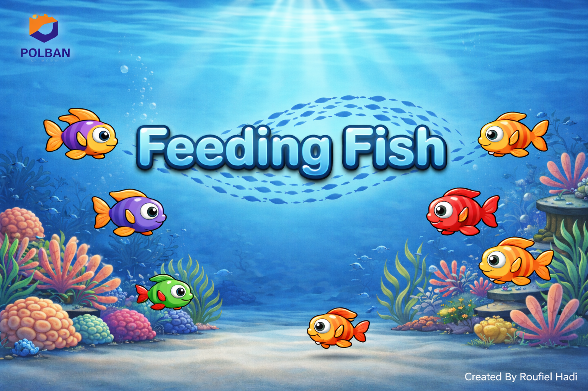
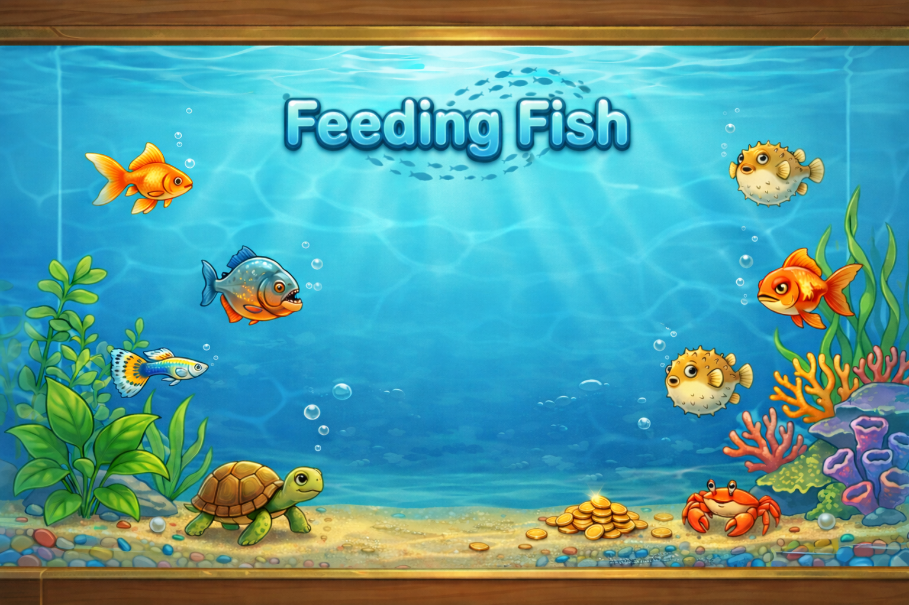
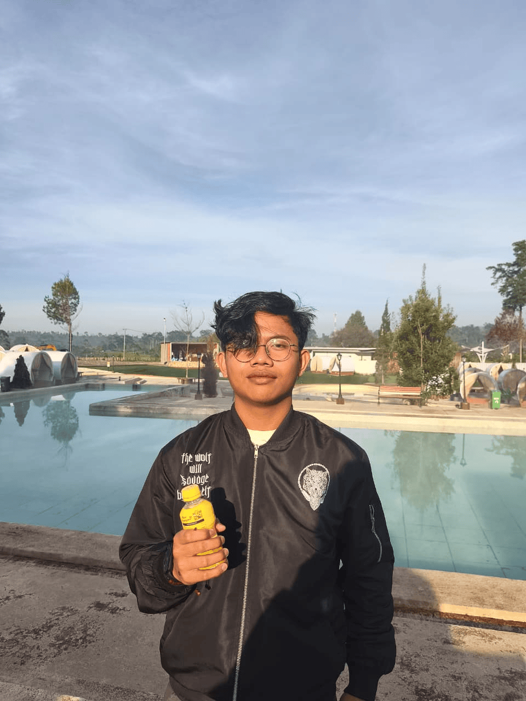

# <div align="center">Feeding Fish</div>

<div align="center">
  
  <p><strong>Game aquarium 2D interaktif berbasis C dan Raylib</strong></p>
  <p>
    Proyek tugas besar Komputer Grafis yang menggabungkan gameplay aquarium management,
    render primitive 2D, serta implementasi algoritma DDA, Bresenham, midpoint circle,
    midpoint ellipse, dan primitive kustom.
  </p>
</div>

<br>

<div align="center">
  
</div>

## Gambaran Umum

**Feeding Fish** adalah simulasi aquarium 2D interaktif di mana pemain dapat masuk dari welcome screen, membuka menu utama, membaca panduan, melihat about page, lalu memainkan gameplay utama untuk memberi makan ikan dan mengelola isi aquarium.

Versi program saat ini sudah menyesuaikan visual dan gameplay dengan tema ikan lokal Indonesia:

- `Ikan cere` sebagai ikan kecil utama
- `Ikan lele` sebagai predator menengah
- `Ikan toman` sebagai predator jumbo

Selain gameplay, proyek ini juga menonjolkan penerapan konsep komputer grafis melalui primitive custom dan algoritma raster yang digunakan untuk membangun objek aquarium, ikan, makanan, bubble, dekorasi, dan antarmuka.

## Tampilan Program

<div align="center">
  <table>
    <tr>
      <td align="center">
        <br>
        <strong>Main Menu</strong>
      </td>
      <td align="center">
        <br>
        <strong>About / Creator</strong>
      </td>
    </tr>
  </table>
</div>

## Fitur Utama

- `Welcome Screen` dengan background PNG aset bawaan dan tombol masuk ke aplikasi.
- `Main Menu` berbahasa Inggris dengan navigasi menuju `Play`, `Guide`, `About`, dan `Exit`.
- `Guide / How To Play` yang menjelaskan alur permainan, objek, serta visualisasi komponen penting program.
- `Gameplay Aquarium` dengan ikan, bubble, pelet, dekorasi, dan UI informasi.
- `About Page` untuk menampilkan identitas pembuat dan konteks akademik proyek.
- `Renderer Ikan Lokal` dengan bentuk berbeda untuk cere, lele, dan toman.
- `Sistem Pakan` dengan batas jumlah pelet aktif dan logika jatuh pelet di aquarium.
- `Sistem Entity dan Update` yang memisahkan data objek, rendering, collision, dan perilaku ikan.

## Alur Program

1. Pengguna masuk melalui `Welcome Screen`.
2. Dari `Main Menu`, pengguna memilih `Play`, `Guide`, atau `About`.
3. Pada `Play`, aquarium akan menampilkan ikan, bubble, makanan, dan dekorasi.
4. Pengguna dapat menjatuhkan pelet ke area air untuk memberi makan ikan.
5. Setiap jenis ikan memiliki karakter visual, ukuran, dan perilaku yang berbeda.
6. `Guide` membantu pengguna memahami objek dan fitur utama program.

## Detail Visual Dan Objek

### Ikan

- `Cere` dirancang sebagai ikan kecil yang lincah.
- `Lele` memiliki bentuk tubuh lebih panjang dengan kumis khas.
- `Toman` dibuat lebih besar dan dominan sebagai ikan jumbo.

### Lingkungan Aquarium

- Background air dibuat menyerupai aquarium dengan gradasi dan dekorasi.
- Dasar aquarium dilengkapi pasir, rumput laut, coral, dan ornamen tambahan.
- Bubble dan pelet menjadi elemen interaktif yang ikut memperkuat suasana aquarium.

### UI

- Halaman menu, guide, dan about menggunakan layout panel yang konsisten.
- Hint, tombol, dan area navigasi dibuat agar mudah dipahami pengguna.
- Guide dirancang untuk tetap ringan namun informatif.

## Algoritma Dan Konsep Grafika

Program ini tidak hanya mengandalkan primitive bawaan Raylib, tetapi juga memanfaatkan modul grafika yang dibuat pada folder `src/utils` dan dipakai kembali untuk membangun object-object permainan.

Konsep yang digunakan:

- `DDA`
- `Bresenham Line`
- `Midpoint Circle`
- `Midpoint Ellipse`
- `Primitive composition`
- `Layered rendering`
- `Entity update system`

## Struktur Proyek

```text
src/
  app/        alur aplikasi, screen menu, guide, assets, layout
  core/       helper dasar game dan state
  entities/   definisi entity permainan
  systems/    logika update, collision, dan perilaku object
  render/     seluruh renderer aquarium, ikan, bubble, pelet, UI
  ui/         komponen antarmuka
  utils/      algoritma dan primitive grafika

assets/
  fonts/      font proyek
  Picture/    icon dan gambar menu
  sounds/     backsound
```

## Teknologi Yang Digunakan

- `C11`
- `Raylib`
- `GCC / MinGW`
- `Makefile`
- `Windows desktop environment`

## Build Dan Menjalankan Program

Pastikan `Raylib`, `GCC`, `windres`, dan `mingw32-make` sudah tersedia.

```bash
mingw32-make
./aquarium.exe
```

Untuk membersihkan artefak build:

```bash
mingw32-make clean
```

## Identitas Pengembang

- `Nama` : Roufiel Hadi
- `NIM` : 241524028
- `Kelas` : 1A
- `Program Studi` : Sarjana Terapan Teknik Informatika
- `Jurusan` : Teknik Komputer dan Informatika
- `Institusi` : Politeknik Negeri Bandung

## Konteks Akademik

- `Mata Kuliah` : Komputer Grafis
- `Jenis Tugas` : Tugas besar / evaluasi proyek
- `Fokus` : visualisasi 2D interaktif dan penerapan algoritma grafika komputer

## Catatan

- Repo ini merepresentasikan versi program yang sudah diperbarui dibanding versi awal.
- Nama ikan, visual guide, tampilan menu, dan struktur kode telah disesuaikan dengan pengembangan terbaru.
- Build artifact tidak disarankan untuk disimpan ke repository GitHub.
